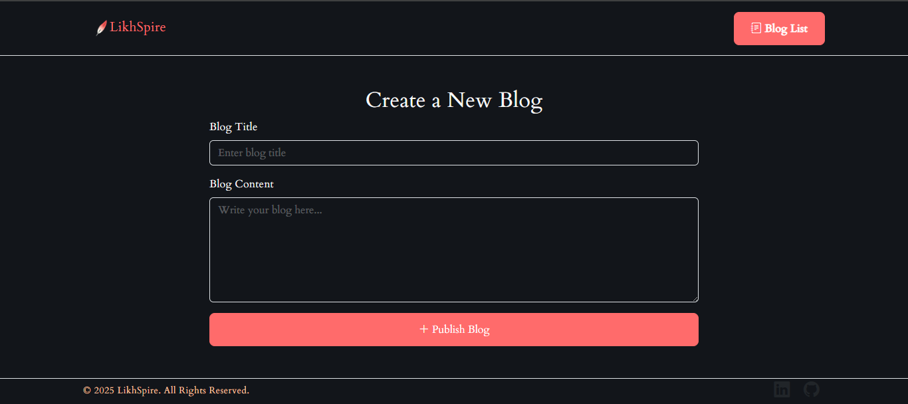
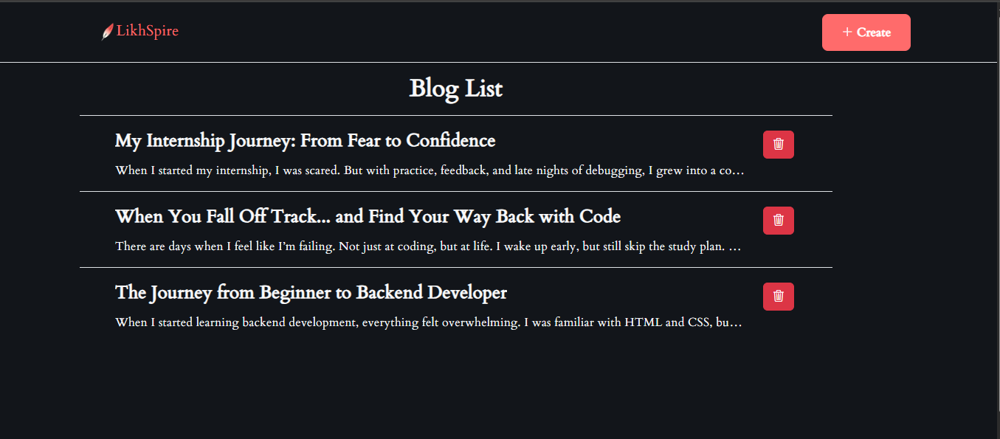
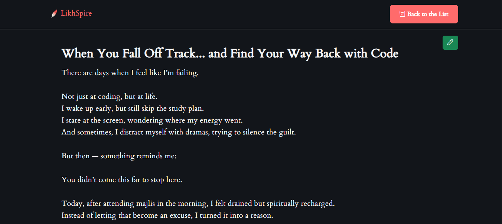

# LikhSpire – A Full Stack Blog Platform

LikhSpire is a full-stack blog website that allows users to create, read, update, and delete blog posts. It was built as a capstone project during Angela Yu’s Full Stack Development Bootcamp. The primary focus was backend development using PostgreSQL, but equal effort was put into the frontend UI to practice design principles and layout structuring.

## Project Objective

- Practice PostgreSQL integration and full RESTful API development
- Implement complete backend structure with CRUD operations
- Design frontend without using templates to test raw Bootstrap and design choices
- Showcase prompt engineering and AI-assisted creative naming and branding

## Features

- Full CRUD functionality (Create, Read, Update, Delete)
- Users can:
  - Write blogs
  - Edit their blogs
  - View blogs by others
  - Delete their own blogs
- UI designed manually to mimic the front page of Medium
- Responsive layout built with Bootstrap

## Tech Stack

### Frontend

- HTML
- CSS
- Bootstrap
- JavaScript

### Backend

- Node.js
- Express.js
- PostgreSQL
- SQL

## UI Preview

### Home Page


### Create Blog Page



### Blogs List



### Blog Detail View



## Live Demo (GIF Preview)

> Here’s a quick walkthrough showing how a user writes a blog, and views blog list:

[[LikhSpire Demo](./screenshots/demo.gif)](https://www.canva.com/design/DAGsAciQf78/I6JJ95EylyUOKpXaAqIYoA/edit?utm_content=DAGsAciQf78&utm_campaign=designshare&utm_medium=link2&utm_source=sharebutton)

## Logo and Name Generation

- The name "LikhSpire" was generated with the help of ChatGPT
- The logo was created using my own prompt engineering skills in QwenLM

## How to Run Locally

```bash
# Clone the repository
git clone https://github.com/kaniz-naqvi/likhspire.git

# Navigate to project directory
cd likhspire

# Install dependencies
npm install

# Ensure PostgreSQL is running and configure your database

# Start the server
npm start
```
